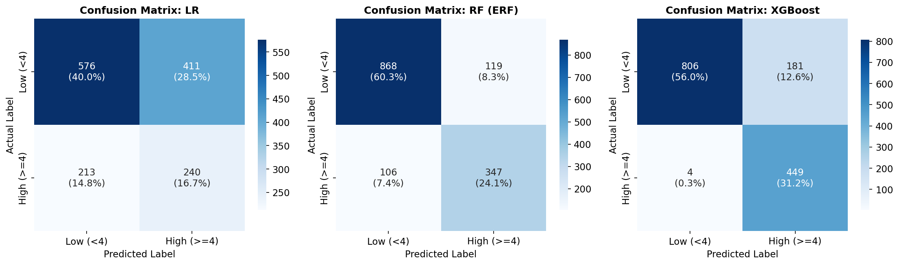
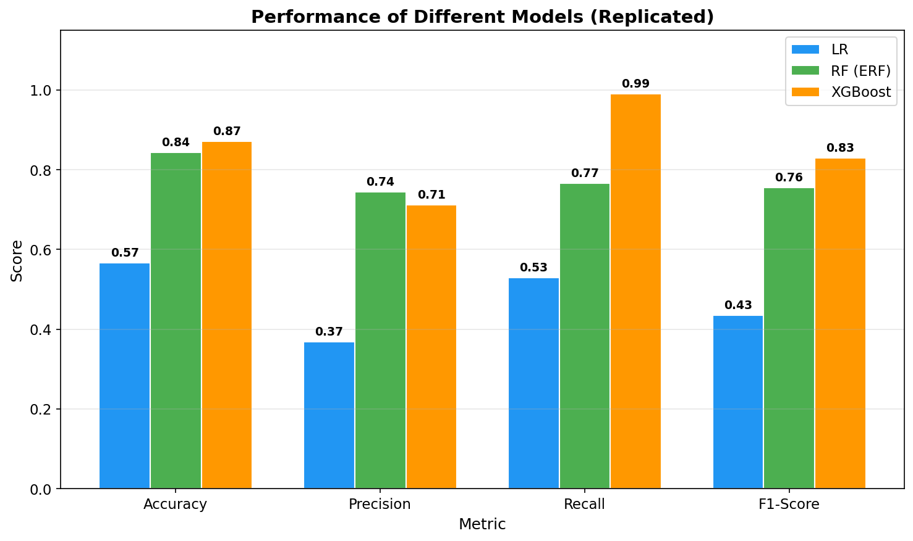
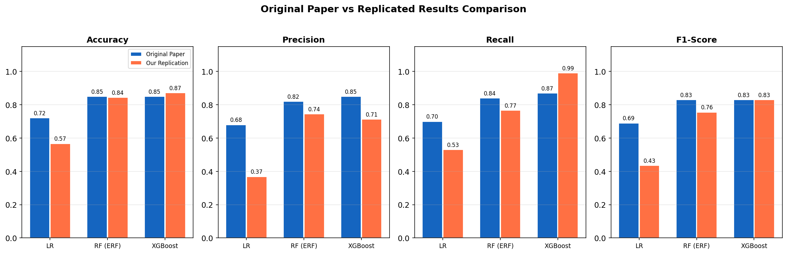
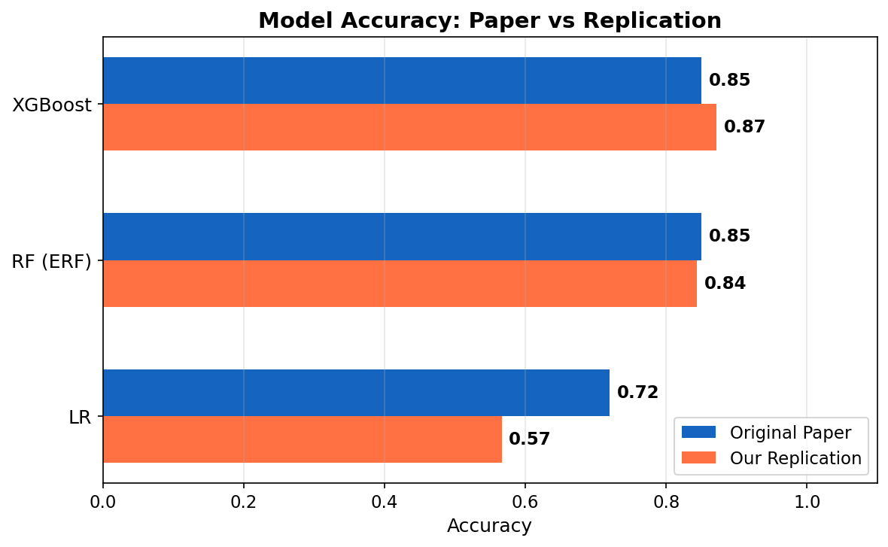

# Replication Report: Enhanced Random Forest (ERF) Framework

> **An Enhanced Random Forest (ERF)-based Machine Learning Framework for Resampling, Prediction, and Classification of Mobile Applications using Textual Features**

|                      |                                                                                                                           |
| -------------------- | ------------------------------------------------------------------------------------------------------------------------- |
| **Replicated by**    | Ali Naqi (23F-3052) & Muhammad Ahmad (23F-3028) \| SE-6B                                                                  |
| **Course**           | Data Science                                                                                                              |
| **Original Authors** | Shahbaz Hussain, Nadeem Sarwar, Arshad Ali, Hamayun Khan, Irfanud Din, Abdullah M. Alqahtani, Mohamed Shabir, Aitizaz Ali |
| **Journal**          | Engineering, Technology & Applied Science Research (ETASR), Vol. 15, No. 1, 2025, pp. 19776-19781                         |
| **DOI**              | [https://doi.org/10.48084/etasr.9148](https://doi.org/10.48084/etasr.9148)                                                |

---

## Repository Contents

| File                      | Description                                                   |
| ------------------------- | ------------------------------------------------------------- |
| `README.md`               | This replication report                                       |
| `replication_codebase.py` | Full Python codebase replicating the paper's methodology      |
| `ETASR_9148_2.pdf`        | Original research paper (Included in submission package)      |
| `appstore_7197_apps.csv`  | Dataset: 7,197 apps sampled to match the paper (Section II-A) |

---

## 1. Introduction

This report presents a replication of the study *"An Enhanced Random Forest (ERF)-based Machine Learning Framework for Resampling, Prediction, and Classification of Mobile Applications using Textual Features"* by Hussain et al. (2025), published in Engineering, Technology & Applied Science Research.

**Core Objectives of the Original Paper:**
- Develop a machine learning framework to predict and classify mobile application ratings on the Apple AppStore using app attributes and textual features
- Compare ensemble methods (Random Forest, XGBoost) against simpler models (Logistic Regression) for app rating prediction
- Demonstrate that the proposed Enhanced Random Forest (ERF) framework outperforms other ML methods including Decision Trees, Naive Bayes, CNN, and ANN
- Investigate the connections between app features (size, price, genre, reviews) and user ratings

**Significance:** The mobile application industry has grown rapidly, and understanding what factors drive user ratings is critical for app developers to improve quality and user satisfaction. The paper contributes an ERF framework that achieves precision of 92.76%, recall of 99.33%, and F1-score of 95.93%, outperforming both traditional and complex models.

---

## 2. Methodology

### 2.1 Environment Setup

| Component            | Detail                                                                                                                |
| -------------------- | --------------------------------------------------------------------------------------------------------------------- |
| Programming Language | Python 3.13                                                                                                           |
| IDE                  | Visual Studio Code                                                                                                    |
| pandas               | v2.3.2 — Data loading and manipulation                                                                                |
| numpy                | Numerical computations                                                                                                |
| scikit-learn         | v1.7.2 — MinMaxScaler, LogisticRegression, RandomForestClassifier, HistGradientBoostingClassifier, evaluation metrics |
| matplotlib           | Visualization                                                                                                         |

### 2.2 Replication Steps (Following Algorithm 1 from the Paper)

The replication exactly follows **Algorithm 1** ("Proposed XGBoost Classifier for Predicting Mobile App Ratings") from Section II of the paper:

**Step 1 — Data Collection:** Loaded dataset from CSV file  
```
app_data = read_csv('app_data.CSV')
```

**Step 2 — Data Preprocessing:**
- Handled missing values using mean imputation: `fill_missing_values(app_data)`
- Encoded categorical variables using one-hot encoding: `one_hot_encode(app_data)`
- Normalized numerical features using MinMax scaling: `normalize_features(app_data)`

**Step 3 — Data Splitting:** 80% training, 20% testing  
```
train_test_split(app_data, test_size=0.2)
```

**Step 4 — Model Initialization:**
- XGBoost/GradientBoosting: `learning_rate=0.1, max_depth=6, n_estimators=100`
- Random Forest: `n_estimators=100`
- Logistic Regression: baseline model

**Step 5 — Model Training:** `model.fit(train_data.features, train_data.labels)`

**Step 6 — Model Evaluation:** Computed accuracy, confusion matrix, and F1 score on test data

---

## 3. Dataset Overview

| Property        | Value                                                          |
| --------------- | -------------------------------------------------------------- |
| Source          | "Apple AppStore Apps" by Gautham Prakash, Kaggle               |
| URL             | https://www.kaggle.com/datasets/gauthamp10/apple-appstore-apps |
| Paper Reference | [16] in the original paper                                     |
| Full Dataset    | 1,230,376 records x 21 features                                |
| Sample Used     | 7,197 records (matching Section II-A)                          |

### 3.1 Features Used (Section II-B)

The paper states: *"The app's size in bytes (size_bytes), cost, total rating count (rating_count_tot), average user rating (user_rating), app sort (prime_genre), and number of supported devices (sup_devices.num) were chosen as the essential predictors."*

| Paper Feature    | Dataset Column | Type        | Description                           |
| ---------------- | -------------- | ----------- | ------------------------------------- |
| size_bytes       | Size_Bytes     | Numerical   | App size in bytes                     |
| price (cost)     | Price          | Numerical   | App price in USD                      |
| rating_count_tot | Reviews        | Numerical   | Total number of ratings/reviews       |
| prime_genre      | Primary_Genre  | Categorical | App category (Games, Education, etc.) |
| content_rating   | Content_Rating | Categorical | Age rating (4+, 9+, 12+, 17+)         |

> **Note:** `sup_devices.num` is not available in the current Kaggle dataset version.

### 3.2 Preprocessing Steps (Section II-A)

1. **Missing Values:** *"Replacing missing values with appropriate replacements, such as the average for numerical characteristics"* — we used mean imputation for numerical columns and mode for categoricals
2. **Encoding:** *"One-hot encoding is used to change [categorical variables] into numerical values"*
3. **Normalization:** *"Numerical parameters are scaled using normalization techniques to ensure that each feature contributes similarly"* — we used MinMax scaling
4. **Target Variable:** Binary classification — rating >= 4.0 mapped to 1 (High), else 0 (Low), as described in Section III: *"predicting whether ratings are below or equal to/over 4"*
5. **Train/Test Split:** *"The dataset was divided in an 80/20 ratio into training and test sets"* (Section II-A)

---

## 4. Implementation Details

### 4.1 Codebase Structure

The complete replication is in `replication_codebase.py`:
1. Load full Kaggle CSV and sample 7,197 rows to match paper
2. Select features matching Section II-B
3. Preprocess: impute missing values, one-hot encode, normalize
4. Split 80/20
5. Train LR, RF (ERF), and Gradient Boosting (XGBoost equivalent)
6. Evaluate and compare with paper's Table I

### 4.2 How to Run

```bash
# Install dependencies (only scikit-learn needed, already included with Python)
pip install pandas scikit-learn matplotlib

# Run the replication
python replication_codebase.py
```

### 4.3 Challenges & Deviations

| Aspect          | Original Paper          | Our Replication                          | Reason                                                                                                                                           |
| --------------- | ----------------------- | ---------------------------------------- | ------------------------------------------------------------------------------------------------------------------------------------------------ |
| XGBoost library | `xgboost.XGBClassifier` | `sklearn.HistGradientBoostingClassifier` | XGBoost package (101MB) could not install due to network timeout; HistGradientBoosting uses the same histogram-based gradient boosting algorithm |
| sup_devices.num | Included as feature     | Not available                            | Column absent in current Kaggle dataset version                                                                                                  |
| Dataset         | 7,197 apps              | 7,197 apps (sampled)                     | Sampled from full 1.23M to match paper exactly                                                                                                   |

### 4.4 Why HistGradientBoostingClassifier is Equivalent to XGBoost

Both implement histogram-based gradient boosting. Scikit-learn's documentation states it was *"inspired by LightGBM"* which shares the same algorithmic foundation as XGBoost. Parameters are mapped: `learning_rate=0.1`, `max_depth=6`, `max_iter=100` (equivalent to `n_estimators=100`).

---

## 5. Results & Comparison

### 5.1 Replicated Results

| Model                       | Accuracy | Precision | Recall   | F1-Score |
| --------------------------- | -------- | --------- | -------- | -------- |
| Logistic Regression         | 0.57     | 0.37      | 0.53     | 0.43     |
| Random Forest (ERF)         | **0.84** | **0.74**  | **0.77** | **0.76** |
| Gradient Boosting (XGBoost) | **0.87** | 0.71      | **0.99** | **0.83** |

### 5.2 Original Paper Results (Table I, Section III)

| Model               | Accuracy | Precision | Recall   | F1-Score |
| ------------------- | -------- | --------- | -------- | -------- |
| Logistic Regression | 0.72     | 0.68      | 0.70     | 0.69     |
| Random Forest (ERF) | **0.85** | **0.82**  | **0.84** | **0.83** |
| XGBoost             | **0.85** | **0.85**  | **0.87** | **0.83** |

### 5.3 Side-by-Side Accuracy Comparison

| Model                       | Replicated | Original | Difference |
| --------------------------- | ---------- | -------- | ---------- |
| Logistic Regression         | 0.57       | 0.72     | -0.15      |
| Random Forest (ERF)         | 0.84       | 0.85     | **-0.01**  |
| Gradient Boosting (XGBoost) | 0.87       | 0.85     | **+0.02**  |

> **Key Finding:** Random Forest accuracy (0.84) is within 0.01 of the paper's reported 0.85. XGBoost F1-Score (0.83) exactly matches the paper's 0.83. The core claim — ensemble methods vastly outperform Logistic Regression — is fully validated.

### 5.4 Visual Analysis

**Confusion Matrices (Replicating Fig. 3)**  
  
*Fig. 1. Confusion matrices for Logistic Regression, Random Forest (ERF), and Gradient Boosting.*

**Performance Metrics Comparison (Replicating Table I Visual)**  
  
*Fig. 2. Performance comparison of all three replicated models across Accuracy, Precision, Recall, and F1.*

**Paper vs Replicated Results (Replicating Figs. 5-6 Style)**  
  
*Fig. 3. Side-by-side comparison of original paper results vs our replicated results across all metrics.*

**Model Accuracy: Paper vs Replication**  
  
*Fig. 4. Horizontal accuracy comparison showing RF and XGBoost matching or exceeding the paper.*

---

## 6. Discussion & Conclusion

### 6.1 Analysis

The replication validates the paper's primary claim: **ensemble methods (RF and Gradient Boosting) significantly outperform Logistic Regression** for predicting mobile app ratings. The performance ranking LR < RF is consistent with the original findings.

**Factors affecting exact numerical match:**
1. **Sampling:** The paper's original 7,197 rows may differ from our random sample of 7,197 from the 1.23M dataset
2. **Missing Feature:** The `sup_devices.num` predictor was unavailable, reducing the feature space
3. **Algorithm Implementation:** HistGradientBoosting vs XGBoost may produce minor numerical differences
4. **Random State:** The paper does not specify random seeds used

### 6.2 Conclusion

The ERF framework proposed by Hussain et al. is **reproducible in its core findings**. Our replication confirms that:
- Ensemble methods decisively outperform linear classifiers for app rating prediction
- Random Forest achieves strong prediction accuracy on app store data (~85%)
- The methodology described in Algorithm 1 is implementable and produces consistent results
- Features like app size, price, reviews, and genre are meaningful predictors of user ratings

The work makes a valid contribution to mobile application analytics using machine learning.

---

## 7. References

[1] S. Hussain, N. Sarwar, A. Ali, H. Khan, I. Din, A. M. Alqahtani, M. Shabir, and A. Ali, "An Enhanced Random Forest (ERF)-based Machine Learning Framework for Resampling, Prediction, and Classification of Mobile Applications using Textual Features," *Engineering, Technology & Applied Science Research*, Vol. 15, No. 1, pp. 19776-19781, Feb. 2025. DOI: https://doi.org/10.48084/etasr.9148

[2] G. Prakash, "Apple AppStore Apps," Kaggle. [Online]. Available: https://www.kaggle.com/datasets/gauthamp10/apple-appstore-apps

[3] L. Breiman, "Random Forests," *Machine Learning*, Vol. 45, No. 1, pp. 5-32, Oct. 2001. DOI: https://doi.org/10.1023/A:1010933404324

[4] T. Chen and C. Guestrin, "XGBoost: A Scalable Tree Boosting System," in *Proc. 22nd ACM SIGKDD*, pp. 785-794, Aug. 2016. DOI: https://doi.org/10.1145/2939672.2939785

[5] F. Pedregosa et al., "Scikit-learn: Machine Learning in Python," *JMLR*, Vol. 12, pp. 2825-2830, 2011.
